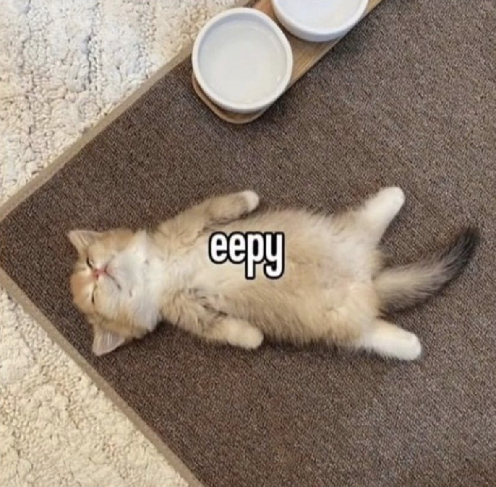

# eepy
Eepy is an esoteric programming language written in 100%
i386 assembly. It has three opcodes:


|  Character | Action                         |
| ---------- | ------------------------------ |
| ż (U+017C) | Increments data pointer        |
| Ž (U+017D) | Decreases  data pointer        |
| ℤ (U+2124) | Output ASCII of data pointer   |

***More soon in later versions...***

# Programs

## `eepy` in Eepy
```
żżżżżżżżżżżżżżżżżżżżżżżżżżżżżżżżżżżżżżżżżżżżżżżżżżżżżżżżżżżżżżżżżżżżżżżżżżżżżżżżżżżżżżżżżżżżżżżżżżżżżℤℤ
żżżżżżżżżżżℤ
żżżżżżżżżℤ
```